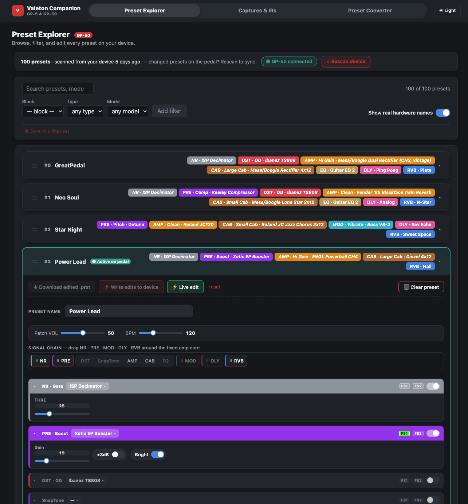
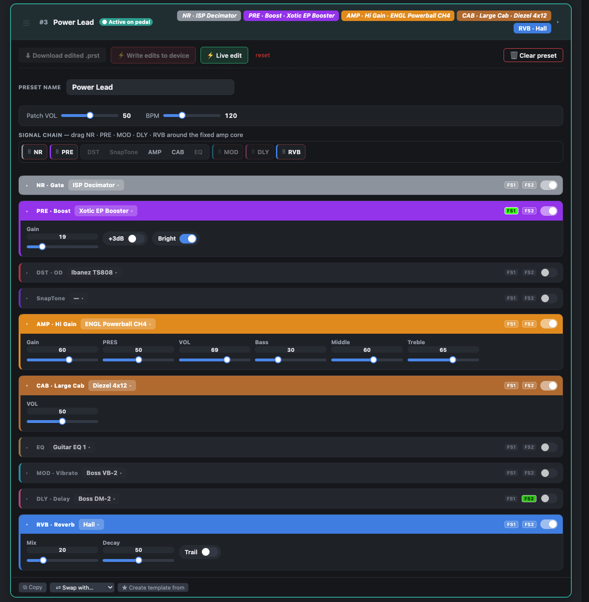
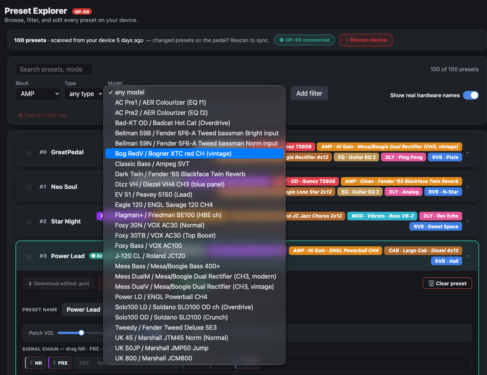
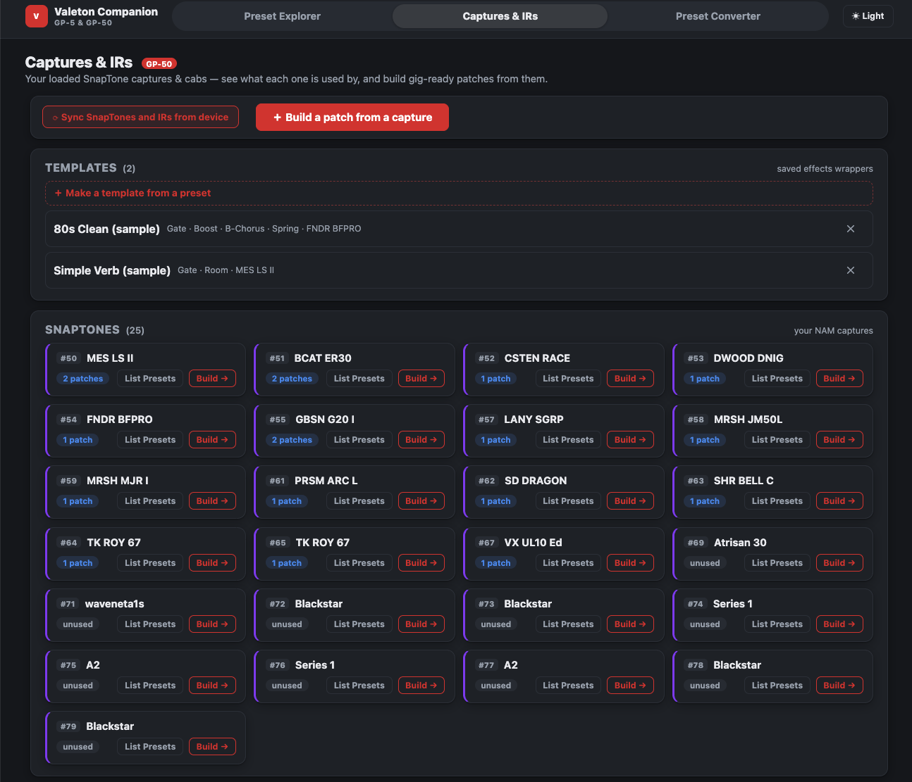
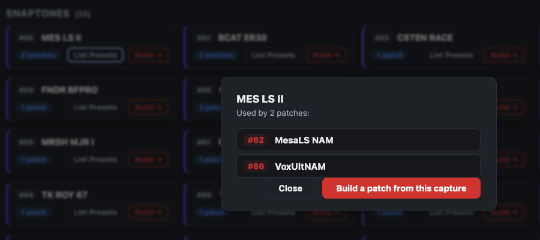
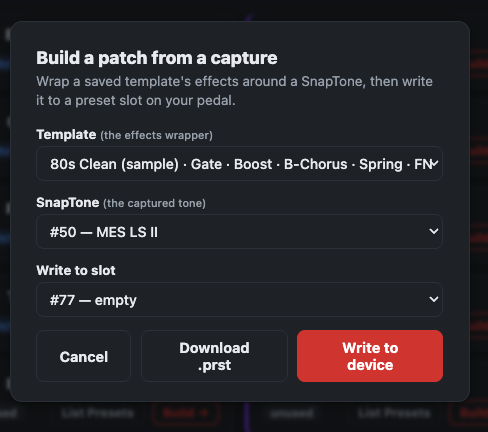
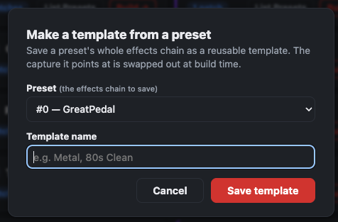
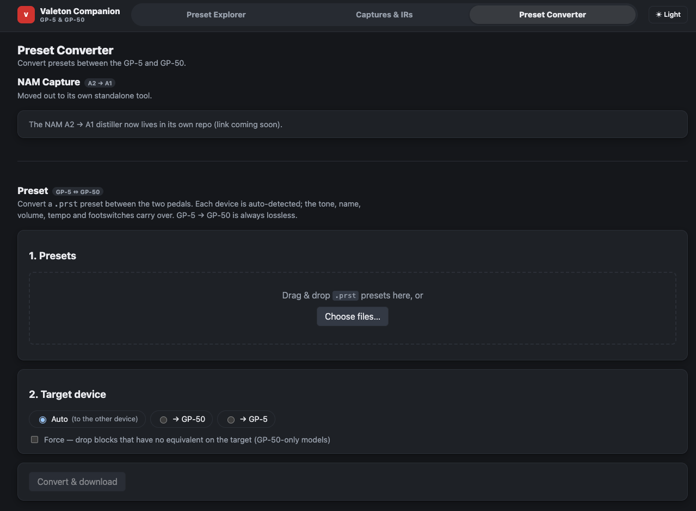

# GP-50 Converter

**Live demo:** [valeton-gp50-woad.vercel.app](https://valeton-gp50-woad.vercel.app) — zero-setup,
runs in-browser (WebMIDI), no local install needed. See [Setup](#setup) below for the full
local app with the batch converter.

A companion app for the **Valeton GP-50** (and GP-5) built by reverse-engineering its
MIDI SysEx protocol from scratch. It reads and writes the pedal live over **WebMIDI**
— no vendor SDK, no drivers — plus batch-converts NAM **A2** captures to NAM **A1**
`.nam` files, since the GP-50 only accepts A1.

**What it does:**

- **Preset Explorer** — reads every preset off the connected pedal; full signal chain
  per preset, block chips color-coded by type.
- **Live editing** — edit a preset's blocks, models, and parameters in the browser;
  changes mirror straight to the pedal over WebMIDI.
- **Model picker** — swap any block's model using Valeton's official hardware names,
  not just internal IDs.
- **Preset rename** — edit a preset's name and write it back to the device.
- **Preset & block reordering** — drag to rearrange presets in a bank, or blocks
  within a preset's signal chain; each reorder is one batched, minimal write.
- **Clear Preset** — wipe a slot back to a factory-blank preset.
- **Captures & IRs browser** — every SnapTone capture and User IR on the device,
  plus reusable templates.
- **Capture usage lookup** — pick a SnapTone or IR and see exactly which presets
  reference it.
- **Build a patch from a capture** — wrap a template's effects chain around a
  SnapTone/IR and write the result to a slot.
- **Make a template from a preset** — save any preset's effects chain as a reusable
  template.
- **Preset Converter** — convert `.prst` preset files between the GP-5 and GP-50
  formats, entirely client-side.
- **NAM A2→A1 batch converter** — drag-drop one or more `.nam` A2 captures, pick an
  output format, and convert with live per-file progress (local app only, needs the
  Python distillation engine — see below).

> The GP-50 only accepts NAM A1. There's no A2→A1 format downgrade (different neural
> architectures), so conversion **distills**: render a DI through the A2 model, then
> train an A1 to reproduce it. See [`a2a1/README.md`](a2a1/README.md) for the engine
> details.

Two ways to run it:
- **Static/WebMIDI-only** (the live demo above) — Explorer, live editing, Captures &
  IRs, and the Preset Converter all run fully client-side, no backend.
- **Full local app** (Setup below) — adds the NAM batch converter, which needs the
  Python distillation engine.

## Screenshots

|  |  |
| --- | --- |
|  **Preset Explorer** — every preset on the pedal, block chips color-coded by type. |  **Preset detail** — full signal chain, per-block params, live edit straight to the pedal. |
|  **Model picker** — swap a block's model, official hardware names included. |  **Captures & IRs** — saved templates plus every SnapTone capture on the device. |
|  **Capture usage** — see exactly which patches reference a SnapTone. |  **Build a patch** — wrap a template around a SnapTone and write it to a slot. |
|  **Make a template** — save any preset's effects chain as a reusable wrapper. |  **Preset Converter** — convert `.prst` presets between the GP-5 and GP-50. |

## Setup

Three Python venvs (the two engine venvs are pinned — see `a2a1/README.md` for why):

```bash
cd /Users/drewmerc/workspace/valeton

# engine venvs
python3 -m venv .venv     && ./.venv/bin/python     -m pip install -r a2a1/requirements-a2.txt   # NAM 0.13.0 (A2 render + 0.7.0 export)
python3 -m venv .venv-a1  && ./.venv-a1/bin/python  -m pip install -r a2a1/requirements-a1.txt   # NAM 0.12.2 (0.5.x export for GP-50)

# web app venv
python3 -m venv .venv-app && ./.venv-app/bin/python -m pip install fastapi "uvicorn[standard]" python-multipart pytest httpx
```

The default DI is `refs/v3_0_0.wav` (official NAM input). Get it via the trainer, or
generate a synthetic fallback: `./.venv/bin/python a2a1/make_di.py refs/v3_0_0.wav`.

## Run

```bash
./run.sh
```

Then open **http://127.0.0.1:8756**.

- **Convert:** drag-drop or pick `.nam` files → choose output format (**0.5.x** for the
  GP-50, or **0.7.0** for newer devices) → set epochs (or hit **Fast (test)**) →
  **Convert**. Watch per-file progress (ESR + format check); download each result.
  Then import the `.nam` into Valeton Suite like any A1 capture.
- **Preset Explorer / Captures & IRs:** connect the pedal over WebMIDI (Chrome/Edge,
  HTTPS or localhost), scan, and browse/edit real device data live — see the
  itemized feature list above.

## Tests

```bash
./.venv-app/bin/python -m pytest app/tests -q -m "not slow"   # fast unit/API/frontend suite
./.venv-app/bin/python -m pytest app/tests/test_e2e.py -q -s  # slow: real headless browser conversion + screenshots
```

## Layout

- `app/` — the FastAPI web app (engine wrapper, job API, static frontend, device stub).
- `a2a1/` — the conversion engine + GP-50 MIDI RE tooling ([README](a2a1/README.md)).
- `refs/` — sample models + the DI input.
- `MVP_REQUIREMENTS.md`, `AUTONOMY.md`, `STATUS.md` — the MVP spec, the build-loop
  protocol, and live build status.

## License

[MIT](LICENSE)

## Scope

Live device read/write (Explorer, live edit, reorder, rename, clear, capture usage,
build/make-template) is reverse-engineered and working over WebMIDI. The app only
talks to the physical pedal when you explicitly connect and scan/write via the
Explorer or Captures & IRs pages.
